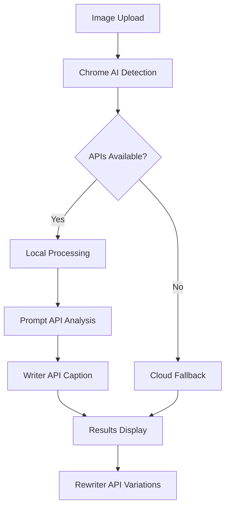

# Perfect Insta Post - Chrome AI Challenge 2025 🏆

[](https://developer.chrome.com/docs/ai/built-in)
[](https://developer.chrome.com/docs/extensions/mv3/)
[](https://developer.chrome.com/docs/ai/built-in)

> **AI-Powered Instagram Content Generator** - Transform any photo into the perfect Instagram post using Chrome's Built-in AI APIs

## 🌟 Overview

Perfect Insta Post revolutionizes content creation by bringing AI-powered Instagram post generation directly to your browser. Using Chrome's cutting-edge Built-in AI APIs, it analyzes images locally and generates engaging captions, hashtags, and suggestions - all while keeping your photos private and secure.

### ✨ Key Features

- **🤖 Local AI Processing** - Uses Chrome's Prompt, Writer, and Rewriter APIs
- **🖼️ Multimodal Image Analysis** - Understands content, mood, and context
- **✍️ Smart Caption Generation** - Creates engaging, personalized captions
- **🔄 Instant Rewrites** - Generate variations with one click
- **🎯 Contextual Hashtags** - Relevant tags based on image content
- **🔒 Privacy-First** - Images never leave your device
- **⚡ Hybrid System** - Local AI with cloud fallback
- **📱 GDPR Compliant** - Built-in privacy controls

## 🚀 Chrome Built-in AI Integration

### APIs Used

| API | Purpose | Implementation |
|-----|---------|----------------|
| **Prompt API** | Multimodal image analysis | `ai.languageModel.create()` with image inputs |
| **Writer API** | Caption generation | `ai.writer.create()` with tone adaptation |
| **Rewriter API** | Content variations | `ai.rewriter.create()` for style changes |

### Smart Hybrid System

```javascript
// Intelligent AI routing
if (chromeAI.available) {
    result = await localAIProcessing(image);  // Privacy + Speed
} else {
    result = await cloudFallback(image);      // Compatibility
}
```

## 📦 Installation

### Prerequisites
- **Chrome Canary** or **Chrome Dev** (for Built-in AI APIs)
- **Compatible hardware**: 22GB+ storage, 4GB+ VRAM
- **Google account** for authentication

### Steps
1. Download the latest release or clone this repository
2. Extract/navigate to the extension folder
3. Open Chrome → Extensions → Enable **Developer Mode**
4. Click **"Load unpacked"** → Select the extension folder
5. The Perfect Insta Post icon appears in your toolbar

```bash
# Clone repository
git clone https://github.com/yourusername/perfect-insta-extension.git
cd perfect-insta-extension
```

## 🎯 How It Works

1. **📸 Upload Image** - Drag & drop or select your photo
2. **🤖 AI Analysis** - Local multimodal processing with Gemini Nano
3. **✍️ Generate Content** - Smart caption and hashtag creation
4. **🔄 Refine** - Use rewrite button for variations
5. **📋 Copy & Post** - One-click copy to clipboard

### Architecture



## 🛠️ Technical Stack

### Core Technologies
- **JavaScript ES6+** - Main extension logic
- **Chrome Extension APIs** - Manifest V3 architecture
- **HTML5/CSS3** - Modern responsive interface

### AI & Machine Learning
- **Chrome Built-in AI APIs** (Prompt, Writer, Rewriter)
- **Gemini Nano** - Local AI model
- **Hybrid processing** - Local-first with cloud fallback

### Backend Services
- **Railway** - Cloud hosting platform
- **Express.js** - API backend
- **Google OAuth 2.0** - Secure authentication

## 🎨 Interface Preview

```
┌─────────────────────────────────┐
│  📸 Perfect Insta Post          │
│  🤖 Local AI Available         │ ← AI Status Indicator
├─────────────────────────────────┤
│  [Image Upload Area]           │
│                                 │
│  📋 Generated Caption:          │
│  "Beautiful sunset at the..."   │
│                                 │
│  #sunset #photography #nature   │
│                                 │
│  [📋 Copy] [✨ Rewrite] [🔄 New] │
└─────────────────────────────────┘
```

## 🔒 Privacy & Security

- **🔐 Local Processing** - Images analyzed on-device only
- **📊 GDPR Compliant** - Built-in consent management
- **🚫 No Image Storage** - Photos never saved or uploaded
- **🔒 Secure Auth** - Google OAuth 2.0 integration
- **🌍 Privacy Controls** - User can delete all data anytime

## 📊 Performance

- **⚡ Sub-second processing** when using local AI
- **📦 233KB package size** - Efficient and lightweight
- **🔋 Battery friendly** - Local processing reduces network usage
- **📱 Responsive design** - Works across different screen sizes

## 🏆 Chrome AI Challenge 2025

This project showcases the transformative potential of Chrome's Built-in AI APIs:

### Innovation Highlights
- **Privacy-preserving AI** - Process images without cloud upload
- **Seamless user experience** - AI capabilities feel native to the browser
- **Democratic access** - Powerful AI tools available to everyone
- **Hybrid intelligence** - Best of local and cloud processing

### Impact
- **2B+ Instagram users** can benefit from AI-powered content creation
- **Privacy-first approach** addresses growing data protection concerns
- **Offline capabilities** work even without internet connection
- **Democratized AI** puts advanced tools in everyone's hands

## 🚀 Future Roadmap

- [ ] **Video Analysis** - Support for Instagram Reels and Stories
- [ ] **Multi-language** - Localized content generation
- [ ] **Brand Voice Learning** - AI adapts to personal writing style
- [ ] **Collaboration Features** - Team workflows for agencies
- [ ] **Analytics Integration** - Performance tracking and insights

## 🤝 Contributing

Contributions are welcome! Please read our contributing guidelines and submit pull requests for any improvements.

### Development Setup
```bash
# Clone and setup
git clone https://github.com/yourusername/perfect-insta-extension.git
cd perfect-insta-extension

# Load extension in Chrome
# 1. Open chrome://extensions/
# 2. Enable Developer Mode
# 3. Load unpacked extension
```

## 📄 License

MIT License - feel free to use this project as inspiration for your own Chrome AI experiments!

## 🏆 Acknowledgments

- **Google Chrome Team** - For the innovative Built-in AI APIs
- **Chrome AI Challenge 2025** - For pushing the boundaries of web AI
- **Open Source Community** - For inspiration and best practices

---

**Perfect Insta Post** - Where AI meets Instagram, privacy meets performance, and every photo gets the words it deserves.

[](https://developer.chrome.com/docs/ai/built-in)